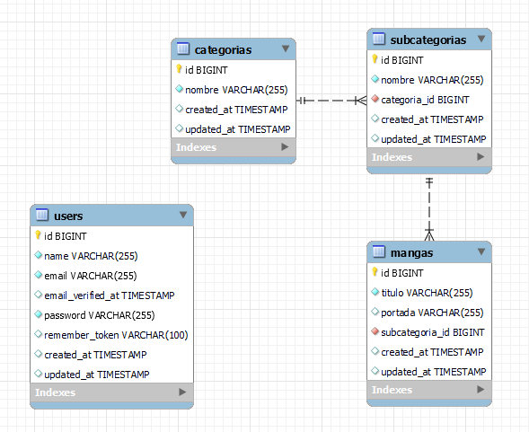

# Mangapp-laravel
Back de la aplicación Mangapp realizada en Laravel

## Pasos previos

1. Contar con PHP y Composer instalados
3. Dentro del directorio abrir una consola y correr el comando
```bash
  composer install
```
4. Copiar el archivo .env.example  y renombrarlo como .env
5. Configurar la contraseña de la base de datos mysql en el archivo .env
6. Colocar los siguiente comandos en la consola:

```bash
php artisan key:generate
php artisan migrate
```

## Ejecución
1. Ejecutar el comando:
```bash
php artisan serve
```
2. Acceder al endpoint para crear un usuario de ejemplo y tener acceso a la zona privada:
http://localhost:8000/api/create-example-user

## Diagrama de la base de datos



## Endpoints
### Zona pública
```bash
GET
/api/create-example-user
/api/listar-categorias
/api/listar-subcategorias
/api/listar-mangas
/api/mangas/img/{id}   (Descarga la imagen de portada de un manga)

POST
/api/login
```

### Zona privada (Requiere autenticación)
Al crear el usuario de ejemplo las credenciales son:
```bash
{
    "email": "email@example.com",
    "password": "password"
}
```
Una vez realizado el login almacenar el token que retorna la petición como un bearer token para los endpoints privados.
```bash
POST
/api/categorias/crear
{
    "nombre": ""
}

/api/subcategorias/crear
(previo debe crearse una categoría)
{
    "nombre": "",
    "categoria_id": 1
}

/api/mangas/crear
En Postman enviar un formulario con los campos (previo debe crearse una subcategoría):
{
  "titulo": "",
  "portada": "",
  "subcategoria_id": 1
}

PUT
/api/categorias/editar/{id}
/api/subcategorias/editar/{id}
/api/mangas/editar/{id}

DELETE
/api/categorias/eliminar/{id}
/api/subcategorias/eliminar/{id}
/api/mangas/eliminar/{id}
```

## Autor

- [@carlostaglio](https://github.com/carlostaglio)

